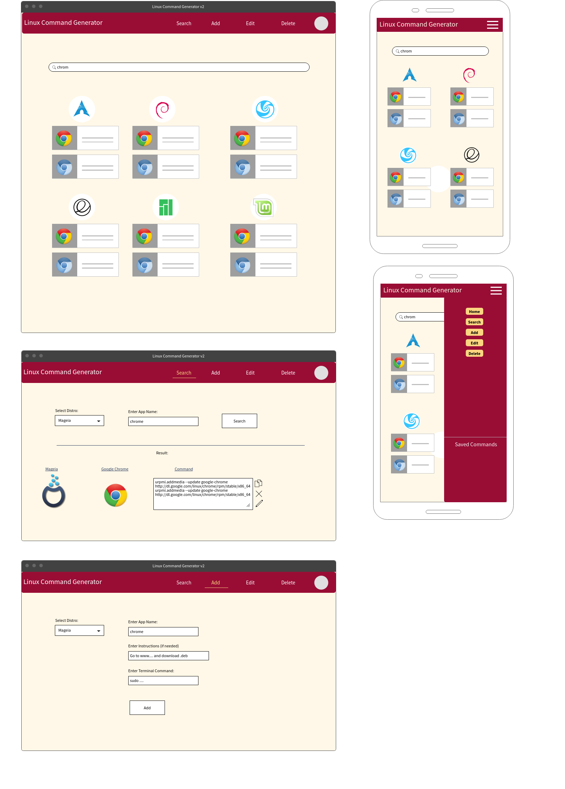
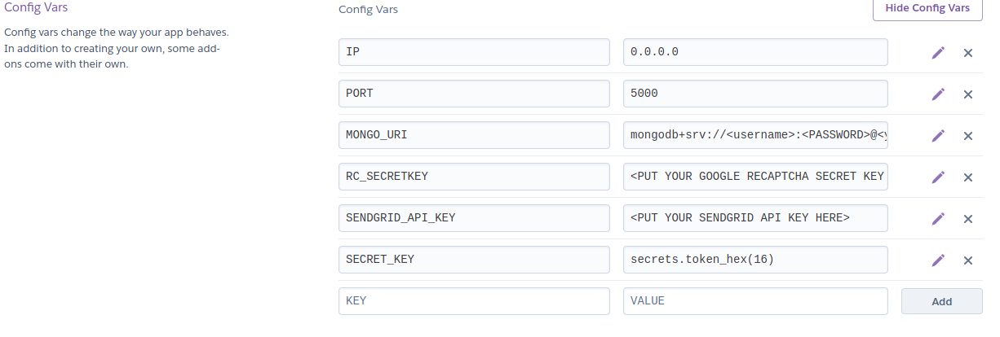

# CI-LinuxCommandGenerator-v2
Code Institute Milestone 3 - Data Centric Development

### Project Description/Goals
The Linux Command Generator v2 is an interface for performing CRUD (Create, Read, Update, Delete) operations on a MongoDB database of linux terminal commands. As a user of linux and occasional distro-hopper I often need to re-install apps and wanted somewhere I could easily access terminal commands for doing so. This is an expansion/continuation of my Interactive Front End milestone Linux Command Generator v1.1 but now with the ability to easily add/update/remove commands as needed. Additionally, one of my future 'like to have' features for the Interactive Front End milestone was the ability to email a list of commands so I wanted to make sure to include that functionality in this version.

Linux Command Generator v2 is deployed to Heroku from the master branch and will automatically update to reflect any new changes pushed.

### Demo
You can view the deployed site on [Heroku](https://linux-command-generator.herokuapp.com/)

### Technologies used
- [Python](https://www.python.org/)
- [Flask](https://flask.palletsprojects.com/en/1.1.x/)
- [PyMongo](https://pypi.org/project/pymongo/)
- [DNSPython](https://pypi.org/project/dnspython3/)
- [WTForms](https://wtforms.readthedocs.io/en/latest/)
- [reCAPTCHA](https://www.google.com/recaptcha/intro/v3.html)
- [Flask-Toastr](https://pypi.org/project/Flask-Toastr/)
- [SendGrid](https://sendgrid.com/)
- [MongoDB](https://www.mongodb.com/)
- [Materialize.css](https://materializecss.com/)
- [HTML](https://www.w3schools.com/html/), [CSS](https://www.w3schools.com/Css/), [JavaScript](https://en.wikipedia.org/wiki/JavaScript)
- [Google Fonts](https://fonts.google.com/)
- [Font Awesome](https://fontawesome.com/)
- [Font-Logos](https://github.com/Lukas-W/font-logos)
- [Material Icons](https://material.io/resources/icons/?style=baseline)

## UX
Given the intended audience & purpose of the site (*Linux enthusiasts* and *simple storage/retrieval of terminal commands*, respectively) I wanted a clean, straight-to-the-point user experience. I ultimately decided to use a card-based layout to achieve this goal and keep animations etc to a minmimum. My approach was the same when it came to the navbar, I wanted to keep the buttons to the fewest necessary to achieve the intended goals to that end certain functions (edit command, delete command) don't have their own dedicated section in the navbar but are rather reached via the main 'Find' page.

Upon first reaching the site I wanted users to be able quickly see what's available while also not overwhelming them with a page of full of commands. To achieve that I decided to present only the distros which currently have commands and to display how many commands are availble for those distros. I later decided that I wanted to at least make users aware that other distros are available but simple don't have any commands to display yet, hence the footer on the main page with a list of empty distros.

### User Stories
- As a Linux user I want a site I can use to look-up common terminal commands to install popular apps.
- As a Linux enthusiast I want to be able to add, update, and delete commands so I can contribute.

### Strategy
The goal of the site is to be fast & easy to achieve the intended use of adding, updating, removing, emailing stored terminal commands. I wanted the layout to be simple and intuitive. Conversely, I wanted to add a little security as well to avoid malicious/spam additions, for this I decided to use recaptcha to avoid the need for an "approval" step where someone would need to view & confirm/accept pending commands before they would be added. However that is a feature I would like to add in future.

### Scope
I decided at the beginning of the project that the must have features were CRUD (Create, Read, Update, Delete) operations, the ability to save commands to a list, the ability to email the saved list. When evaluating what kind of security measures to put in place I considered adding a login/sign-up option and then having the create/delete functions only available from within but detemined that ran counter to the previously decided upon objective of being simple & straight to the point.

In terms of available operations, I considered "Edit Distro" and "Delete Distro" ops but again decided that if the intended goal was straight-to-the-point *COMMAND* retrieval then distro based operations were out of scope, and it was better to offer a simple "Add distro" operation for cases where a user wants to add a command but the distro in question isn't available. Since I intend to use the site myself when distro hopping and something I often find myself doing is copying & pasting commands I wanted to make this option as simple as possible, thus there is a *copy* button on all cards where a command is displayed.

### Skeleton
#### Wireframes

### Surface
For the look of the site I wanted something bright & simple. I was picturing comicbook colours and similarly "cartoonish" fonts. With comicbook colours in mind I eventually decided on a "Captain America" type Blue (#478eff) colour [*this was changed to a deeper blue of #004ecc to improve accessibility*] as the main navbar colour. Using the [sessions.edu color calculator](https://www.sessions.edu/color-calculator/) I decided upon the "triadic" colours of yellow (#ffed47) [*this was changed to a deeper yellow of #c2af00 to improve accessibility*] & pinkish (#ff476c) [*this was changed to a deeper pink of #b30021 to improve accessibility*] to accompany the blue (mostly to be used for highlights & hovers). In keeping with the cartoonish theme I wanted some colorful images and stumbled upon [https://illlustrations.co/](https://illlustrations.co/). Grabbing some computer-related images from there I implemented a random_images function to choose which of the selection of images to display when the main page loads.

After implementing the card layout and basic CRUD operations I found that the cards were looking a little cluttered/busy with the varying "instruction" and "command" lengths, so I used the material.css "truncate" class to abbreviate those fields and have the full content appear instead in a tooltip when hovered. 

To keep with the 'cartoonish' feel established with the colorscheme & images I chose google's (Modak)[https://fonts.google.com/specimen/Modak?query=modak] font for the headings.

### Features
- Responsive navbar
- Randomly changing header image on main page
- Responsive card layout
- My List section to allow users to save commands for later
- Email My List function to allow users to email their list of saved commands
- Simple user friendly interface

### Future Features
- Peer-approval feature where commands added are flagged as un-approved in some way until an admin user evaluations & approves them.
- Download/email saved commands as a shell script
- Ability to edit or delete Distros limiting deletion to only distros which do not have any commands

## Deployment

### Create a local copy
To make a local copy of the repo on your machine:

- Create a folder in the desired location on your computer.
- Open a terminal ([Mac instructions](https://macpaw.com/how-to/use-terminal-on-mac)|[Windows instructions](https://www.quora.com/How-do-I-open-terminal-in-windows)|[Linux instructions](https://www.howtogeek.com/howto/22283/four-ways-to-get-instant-access-to-a-terminal-in-linux/))
- Navigate to the folder you created using `cd` command in terminal (e.g. `cd ~/Documents/LinuxCommandGenerator-v2`)
- Type `git init`
- Next type `git clone https://github.com/nealbrophy/CI-LinuxCommandGenerator-v2`
- To break the link between your local copy and the repo at https://github.com/nealbrophy/LinuxCommandGenerator type `git remote rm origin`

### To run locally
#### requirements
In order to run the app locally you'll need:
- 1.) A MongoDB a/c
- 2.) A google account
- 3.) A sendgrid account
- 4.) Python 3.6 or later and pip package manager (I recommend [using pipenv to create a virtual environment](https://www.youtube.com/watch?v=6Qmnh5C4Pmo) before completing the `pip install` steps below)
- 5.) To declare some environment variables

#### ReCAPTCHA
Go to the [ReCAPTCHA](https://www.google.com/recaptcha/intro/v3.html) site and login with your google account. Create a new `reCAPTCHA v2` with the following settings:
- reCAPTCHA type = `reCAPTCHA v2` > `"I'm not a robot tickbox"`
- Domains = `0.0.0.0` (if you intend to deploy to Heroku or another platform you will need to add the eventual domain here also)
- Accept the Terms of Service and choose *Send alerts to owners*
- You will receive two keys (SITE KEY and SECRET KEY), take note of these or save them for later (alternatively you can retrieve them from your admin console if necessary)

#### SendGrid
Create a [SendGrid](https://app.sendgrid.com) account and follow their instructions to create an API template & retrieve your `SENDGRID_API_KEY` and add this to your environment variables file see [below](#Environment-Variables)

#### MongoDB
- [Create a MongoDB a/c](https://account.mongodb.com/account/register)
- Create a Project if not already done.
- Create a Cluster named `linuxCmdGen`
- Create two collections within that cluster, one called `distros`, one called `commands`
- Click on `Database Access` under the SECURITY section and create a new DataBase user (make note of the username & password)
- Click on `Clusters` and in the cluster overview click the `connect` button and choose `Connect your application`
- Choose `Python` as the Driver and `3.6 or later` as the version
- Copy the `Connection String Only` and proceed to the Environment Variables section below

#### Environment-Variables
In your text-editor/IDE of choice navigate to the root directory of the clone/download LinuxCommandGenerator-v2 project:
- create a file named `env.py`
- at the top of the file type `import os`
- below that type `import secrets`
- below the imports declare the following vairables:
    - `os.environ['IP'] = '0.0.0.0'`
    - `os.environ['PORT'] = '5000'`
    - Populate the following variable with the link you copied from mongoDB making sure to populate your PASSWORD
        - `os.environ['MONGO_URI'] = 'mongodb+srv://<username>:<PASSWORD>@<yourcluster>.mongodb.net/test?retryWrites=true&w=majority'`
    - `os.environ['RC_SECRETKEY'] = '<PUT YOUR GOOGLE RECAPTCHA SECRET KEY HERE>'`
    - `os.environ['SENDGRID_API_KEY'] = '<PUT YOUR SENDGRID API KEY HERE>'`
    - `os.environ['SECRET_KEY'] = secrets.token_hex(16)`

#### Pip
Open a terminal in the root directory (or if you're using VSCode type Ctrl+Shift+` to open a terminal) and type:
- `pip install -r requirements.txt`

#### Run
You should now be able to run the app by opening a terminal in the root directory (or if you're using VSCode type Ctrl+Shift+` to open a terminal) and typing:
- `python app.py`

#### Deploy to Heroku
If you would like to deploy your version to heroku you can follow the steps below:
- Create a [Heroku](https://www.heroku.com/) account
- Click `New` and `Create New App`
- Give your app a name and choose a region and click `Create App`
- Go to `Settings` and click `Reveal Config Vars`
- You should now add config vars here to match those created [above](#Environment-Variables) in your local env.py file. The finished result should look like this:

- In your text-editor/IDE type:
 - `echo web: python app.py > Procfile`
- Go to the `Deploy` section on your heroku project and follow the instructions to push your app to the heroku git

## Testing
I intended to test this app using a variety of unit tests and attempted to do so with unittest, nose2, and pytest, however, the presence of ReCAPTCHA prevented me from running said tests (I was unable to get [captcha-harvester](https://pypi.org/project/captcha-harvester/) working to get around this) so manual user-testing had to suffice.

### Manual User Testing
The app was tested locally and deployed to Heroku on both laptop & desktop using a variety of browsers (Chrome, Brave, Firefox, Ephemeral) and on 4 different Linux distributions (Manjaro, Elementary, openSUSE, Fedora). I made heavy use of the developer tools in each of the mentioned browsers to test the responsiveness of the app.

To put the app through it's paces I tried each of the CRUD operations repeatedly adding, editing, deleting commands and distros. In particular I executed the following tests multiple times on the above mentioned operating systems & browsers:

#### Homepage
- Home page shows only distros with commands as cards
- As commands are added/removed the count displayed on the cards updates to match
- If all commands are remove from a distro, the distro no longer displays as a card
- If commands are added to an empty distro it now appears on the home page as a card
- Clicking magnifyer icon on distro card takes you to Find Commands page with search results for the distro you clicked on
- Cards show relevant distro logo beside distro name

#### Find-Commands
- Searching by partial app name returns relevant results
- Searching by app name with no distro returns all results for app regardless of distro
- Searching by app name AND distro returns only the searched app(s) for that specific distro
- Search by distro only returns all commands for that distro
- Clicking the app name takes you to the single-command page for that specific command
- Clicking the pencil/edit icon on command card takes you to the edit page for that specific command
- Clicking the trashcan/delete icon on command card takes you to the delete page for that specific command
- Clicking the bookmark/add-to-list icon on command card adds that specific command to MY_LIST and takes you to the MY_LIST view
- Clicking the copy/copy-command icon copies that specific command to clipboard

#### Add-Command
- App Name, Distro, App Instruction, App Command, and ReCAPTCHA are mandatory
- If command already exists for selected distro redirect user and present a message advising that command already exists
- If command doesn't exist for selected distro, add command, present confirmation message, and redirect user to Find Commands page showing the command just added
- List of distros available on the Add Command & Edit Command pages updates to reflect newly added/remove distros.

#### Add-Distro
- Distro Name and Distro Logo fields are mandatory
- If distro already exists present a message advising same
- If distro doesn't exist add it & redirect user to home page showing distros
- Distro logo populates on cards on Home page to reflect the class added on Add Distro page

#### My List
- Page shows 'You haven't saved any commands yet' only if *My List* is empty
- Pink back button and 'Email My List' button are visible if *My List* contains commands
- Clicking the pencil/edit icon on command card takes you to the edit page for that specific command
- Clicking the clear/remove icon on command card removes the card from *My List*
- Clicking the Email My List button takes user to Send email page
- Clicking Pink back button takes user to previous page

#### Edit-Command
- Fields display the correct info from selected command
- App Name, Distro, App Instruction, and App Command fields are mandatory
- Changes made to these fields are reflected in the command (if saved/submitted)
- Clicking the cancel button takes users to the previous page

#### Delete-Command
- Fields display the correct info from selected command and are NOT editable
- Clicking the cancel button takes users to the previous page
- Deleting the command presents a confirmation message and redirects users back to the find commands page
- Removing a command removes the selected command from DB and this is reflected elsewhere in the app

## Validation

#### Python
Python was validated using VSCode's PyLint add-on and Python Language Server. At the time of final commit there were no "Problems" present.

#### HTML
All pages pass validation using the [W3C Markup Validation Service](https://validator.w3.org/)
- distros.html
- add_command.html
- add_distro.html
- find_command.html
- base.html
- command.html
- delete_command.html
- edit_command.html
- my_list.html
- send_list.html

#### CSS
The stylesheet `static/style.css` passes validation using the [W3C CSS Validation Service](https://jigsaw.w3.org/css-validator/validator)

#### JavaScript
The JavaScript in `static/script.js` passes validation using [JSHint](https://jshint.com/) and [Esprima Syntax Validator](https://esprima.org/demo/validate.html)

#### Accessibility
- The colours in this project were each revised to a deeper shade in order to pass accessability checks from WebAIM using their [Contrast Checker](https://webaim.org/resources/contrastchecker/).
- The general accessibility of the site was validated & adjusted using WebAIM's [WAVE tool](https://wave.webaim.org/).

## Bugs

### Open Bugs
- On certain browsers (Ephemeral) clicking the "copy command" icon will also cause the page to scroll down.
    - **CAUSE**: Unknown.
- Flask-Toastr allows you to specify a different, local CSS file to restyle the toasts, however, doing so causes a 404 error to appear in the console.

### Squashed Bugs
- Delete confirmation screen would always proceed to delete regardless of whether Delete or Cancel button was selected.
    - **CAUSE**: This was due to the WTForm SubmitField response being a boolean. So the response would always be True regardless of which button was clicked since both are valid Submit buttons.
    - **FIX**: Remove the Cancel version of the SubmitField button and replace with a link to the default Find view.
- pylint validator presents problems/warnings saying *Instance of 'WTForm_with_ReCaptcha' has no 'errors' member*
    - **CAUSE**: See [Nearoo's answer on stackoverflow](https://stackoverflow.com/a/52927347)
    - **FIX**: Added .pylintrc file to root directory as outlined in stackoverflow answer
- ReCAPTCHA form data in POST transmits with value of None.
    - **CAUSE**: Still not entirely sure why but the problem was being caused by having the choices parameter in WTForm SelectField populated by a dictionary (which in turn was populated from MongoDB).
    - **FIX**: Using the 'coerce=str' placeholder in the form definition, then populating  within the Flask Views using a for loop to populate a list with values for the SelectField choices. See [this stackoverflow answer](https://stackoverflow.com/a/48236887) for more information.

# Credits/Acknowledgements
## Tutorials/Walkthroughs/Explanations & general guidance via:
- [Regex Query in Mongo docs](https://docs.mongodb.com/manual/reference/operator/query/regex/) 
- [this stackoverflow question](https://stackoverflow.com/questions/3305561/how-to-query-mongodb-with-like)
- John Sobanski's [Easy ReCAPTCHA with Flask-WTF](https://john.soban.ski/add-recaptcha-to-your-flask-application.html)
- soumilshah1995's [YouTube demo](https://www.youtube.com/watch?v=MmHrncoIOO8)
- Various [Traversy Media](https://www.youtube.com/user/TechGuyWeb/) tutorials
- Reindert-Jan Ekker's [Flask Into on Pluralsight](https://www.pluralsight.com/courses/flask-getting-started)

## Site images
- Abstract background vector from [Creative_hat on freepik](https://www.freepik.com/free-photos-vectors/banner)
- illustrations by [vijay verma](https://illlustrations.co/)
- Tux icon from [Favicon.cc](https://www.favicon.cc/?action=icon&file_id=899032)

## Copy-to-Clipboard
- CopyToClipboard function from my [LinuxCommandGeneratorv1.1 project](https://github.com/nealbrophy/LinuxCommandGenerator_v1.1) which in turn was based on [Dean Taylor's](https://stackoverflow.com/users/406712/dean-taylor) excellent answer on [StackOverflow](https://stackoverflow.com/questions/400212/how-do-i-copy-to-the-clipboard-in-javascript)

## Distro logos
- from [font-logos by lukas-w](https://github.com/lukas-w/font-logos)

## Wirefreams created using:
[MockFlow](https://mockflow.com)

## Developed using
- [Visual Studio Code](https://code.visualstudio.com/) & [Code - OSS](https://github.com/microsoft/vscode/wiki/Differences-between-the-repository-and-Visual-Studio-Code)
- [PyCharm](https://www.jetbrains.com/pycharm/)
- [GitKraken](https://gitkraken.com/)
- [Manjaro](https://manjaro.org/)
- [Ubuntu](https://ubuntu.com/)
- [Elementary OS](https://elementary.io/)
- Star Labs [Star Lite Mk II](https://starlabs.systems/pages/star-lite)

#### Installation instructions written/compiled with help from:
- [All Techs Tricks](https://alltechstricks.blogspot.com/)
- [LinuxBabe](https://www.linuxbabe.com/)
- [FOSSLinux](https://www.fosslinux.com/)
- [TecRobust](https://www.tecrobust.com/)
- [ItsUbuntu](https://itsubuntu.com/)
- [DraSite](https://drasite.com/)
- [LinuxHint](https://linuxhint.com)
- [AddictiveTips](https://www.addictivetips.com/)
- [OSRadar](https://www.osradar.com/)
- [ArchLinux Wiki](https://wiki.archlinux.org/)
- [suse.com](https://www.suse.com/c/working-command-line-basic-linux-commands/)
- [opensuse-guide](https://opensuse-guide.org/command.php)
- [opensuse.org](https://en.opensuse.org/)
- [ScottLinux](https://scottlinux.com/)